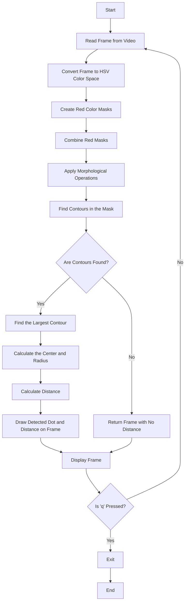
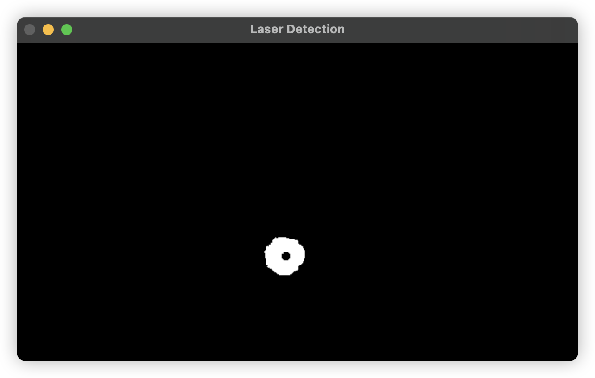
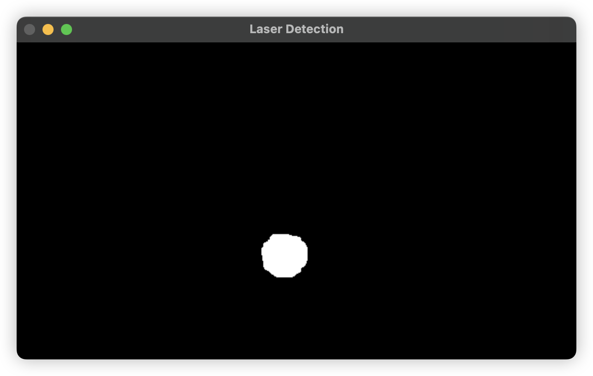
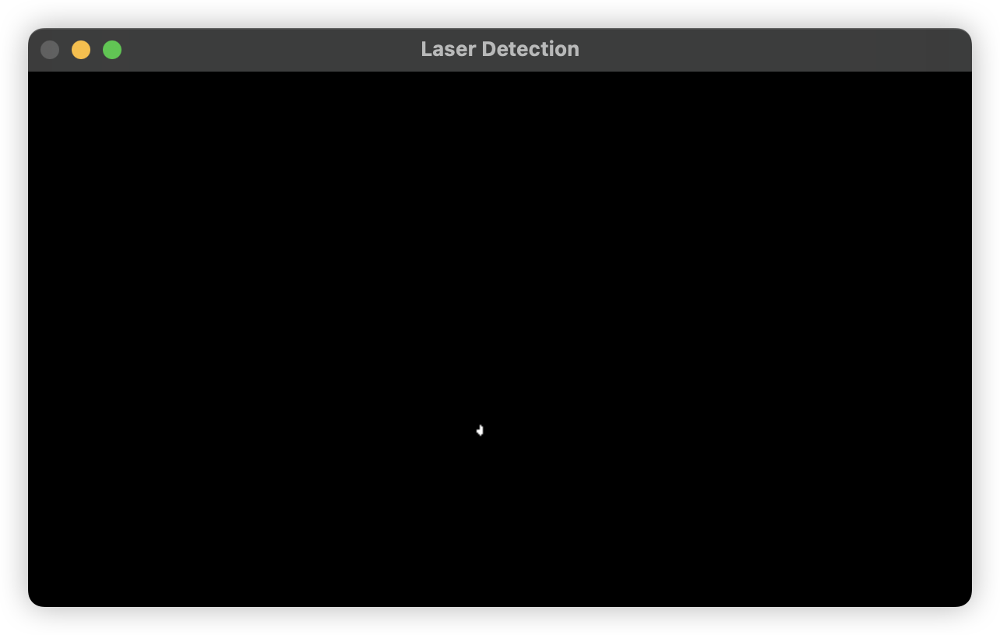
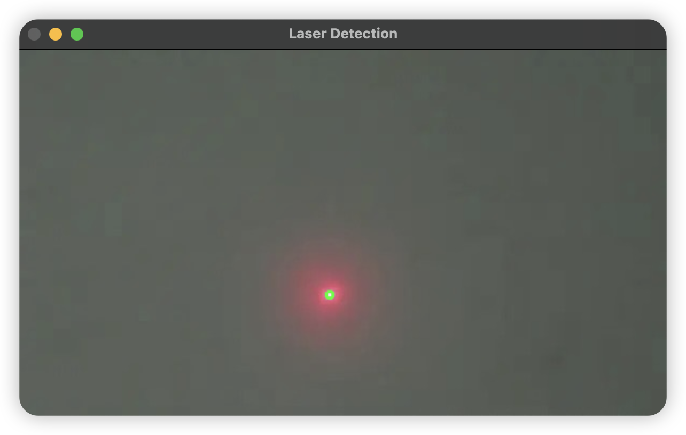
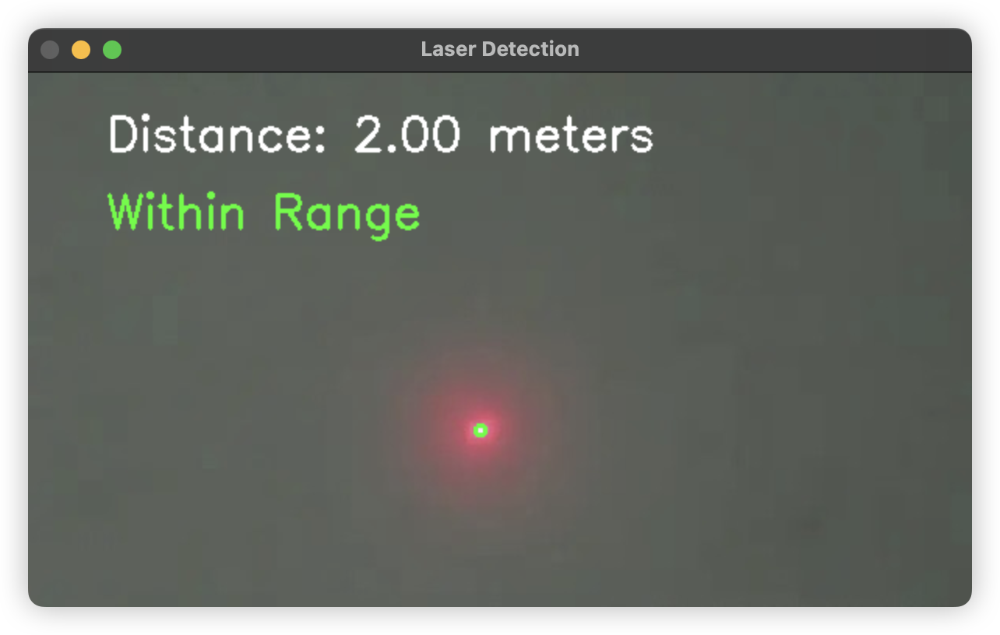

# Laser Pointer Distance Calculator

This Python script is designed to detect a red laser pointer dot in a video stream and calculate the distance to the
laser pointer based on its size. It uses the OpenCV library for image processing and analysis.

## Overview

The script processes video input from a camera (or a video file) to detect the position of a red laser dot. The distance
to the laser is calculated using the known size of the laser dot. The detection is based on color filtering in the HSV
color space and utilizes contour detection techniques.

## Requirements

To run this script, ensure you have the following installed:

- Python 3.x
- OpenCV
- NumPy

You can install the necessary libraries using pip:

```bash
pip install opencv-python numpy
```

## Constants

### Distance and Shape Parameters

```python
KNOWN_DISTANCE = 2.0  # meters
KNOWN_RADIUS = 3  # pixels
TOLERANCE = 0.1  # meters (10 cm tolerance)
```

- `KNOWN_DISTANCE`: The distance to the laser pointer when the radius of the laser dot is known.
- `KNOWN_RADIUS`: The expected radius of the laser dot in pixels.
- `TOLERANCE`: Acceptable margin of error for distance measurement.

### Color Ranges

```python
lower_red1 = np.array([0, 100, 160])  # Lower range for red color
upper_red1 = np.array([10, 255, 255])  # Upper range for red color

lower_red2 = np.array([160, 100, 160])  # Lower range for red color
upper_red2 = np.array([180, 255, 255])  # Upper range for red color
```

These arrays define the HSV color ranges for detecting red colors. Since red can appear in two segments of the HSV color
space, we specify two ranges.

## Core Ideas

The following flow diagram illustrates the process of detecting the laser pointer:



## The methods to extract the laser dot

### 1. Color Filtering

1. Convert the frame to the HSV color space.
2. Mask the red color in the frame using the specified color ranges.

Result: 

### 2. Dilate

Dilate the mask to fill in the center of the laser dot, which is white and neglected in the color filtering step.

Result: 

### 3. Erode

Erode the mask to remove the surrounding red light beam and keep only the laser dot in the center.

Result: 

### 4. Contour Detection

Find the dot radius and position by matching the image with circle contours.

Result: 

### 5. Distance Calculation

Calculate the distance to the laser pointer based on the known size of the laser dot.

The formula used for distance calculation is:

$$ distance = \frac{KnownRadius * KnownDistance}{radius} $$

Result: 